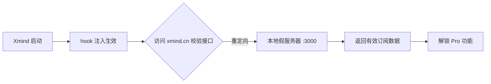

# Xmind+Pro

> Xmind 桌面端订阅状态本地化补丁工具 —— 支持 **Windows** 与 **macOS** 双平台

本项目通过**本地密钥替换 + 请求重定向**的方式，让 Xmind 桌面版在本地完成订阅/会员状态校验，无需官方账号订阅即可使用高级功能（Pro 会员能力）。

## 工作原理

1. 脚本生成一对新的 RSA 密钥（私钥 `key.pem`、公钥 `new_public_key.pem`），用私钥构造一份**有效订阅信息**作为许可数据（`license_data`）。
2. 解包官方 `app.asar`，把 `crack/` 下的 hook 代码注入主进程入口。
3. 将渲染进程内**硬编码的官方公钥**替换为本地新公钥，让本地生成的订阅数据能通过官方解密校验逻辑。
4. hook 在主进程内启动一个本地假服务器（`http://127.0.0.1:3000`），把 Xmind 发往 `https://www.xmind.cn` 的请求重定向到本地并返回"已订阅"响应。
5. 重新封包 `app.asar`，完成。



## 平台支持

| 平台 | 安装路径 | 入口脚本 | 补丁后附加步骤 |
| --- | --- | --- | --- |
| 🪟 Windows | `%LOCALAPPDATA%\Programs\Xmind\resources` | `一键脚本.bat` | 无 |
| 🍎 macOS | `/Applications/Xmind.app/Contents/Resources` | `一键脚本.command` | 自动 ad-hoc 重签（不重签系统会拒绝启动） |

---

## macOS 版使用教程

### 环境要求

- macOS（Apple Silicon / Intel 均可）
- 已安装 Xmind 桌面版（官方安装包版，装在 `/Applications/Xmind.app`）
- 已安装 Python 3（`python3 --version` 验证）；未安装可用 `brew install python` 安装

### 安装与运行

```bash
# 1. 克隆仓库
git clone https://github.com/bestxiangest/xmind-pro-activation.git
cd xmind-pro-activation

# 2. 一键运行（Finder 双击 一键脚本.command 亦可）
./一键脚本.command
```

脚本会依次完成：创建虚拟环境 → 安装依赖 → 解包并注入 asar → 封包 → 自动重签。

### 验证步骤

```bash
cd xmind-pro-activation
venv/bin/python xmind.py          # 手动执行
codesign --verify --deep --strict /Applications/Xmind.app   # 应显示签名有效
```

最后**完全退出 Xmind 再重新打开**，进入 设置 → 账户，即可看到订阅有效状态。

### 注意事项

- 补丁会修改 Xmind 官方签名（改为 ad-hoc），本机使用不受影响；系统可能提示"未验证的开发者"时，用 `右键 → 打开` 即可。
- 升级 Xmind 前先备份 `app.asar.bak`（脚本封包前会自动生成），或升级后重新运行本工具。
- Xmind 安装在非默认位置时：`export XMIND_RESOURCES_DIR=/你的路径/Contents/Resources` 后再运行脚本。

---

## Windows 版使用教程

### 环境要求

- Windows 10 / 11（64 位）
- 已安装 Xmind 桌面版（默认装在 `%LOCALAPPDATA%\Programs\Xmind`）
- 已安装 Python 3（勾选 **Add Python to PATH**；未安装去 [python.org](https://www.python.org) 下载）

### 安装与运行

1. 下载仓库并解压（或 `git clone`）。
2. 双击 `一键脚本.bat`。

脚本会自动：创建虚拟环境 `venv` → 安装依赖 → 解包注入 → 封包替换。

### 验证步骤

```bat
venv\Scripts\python xmind.py
```

完全退出 Xmind 再重新打开，进入 设置 → 账户，查看订阅状态。

### 注意事项

- 运行前**关闭 Xmind**，否则 `app.asar` 可能被占用导致封包失败。
- 杀毒软件可能拦截脚本修改 `Programs` 目录，属正常行为；可临时加入白名单。
- 升级 Xmind 前先备份 `resources\app.asar.bak`。

---

## 项目结构

| 文件 | 说明 |
| --- | --- |
| `xmind.py` | 主流程：密钥生成、asar 解包、注入、换钥、封包、macOS 重签 |
| `crack/hook.js` | 注入主进程的本地假服务器 + 占位符 `{{license_data}}` |
| `crack/hook/electron.js` | 拦截 `electron.net.request`，重定向 `www.xmind.cn` 请求到本地 |
| `crack/hook/crypto.js` | 拦截 `crypto.publicDecrypt`，用本地新公钥解密（占位符 `{{old_public_key}}` / `{{new_public_key}}`） |
| `old.pem` | 官方旧公钥，用于定位渲染进程中的硬编码密钥 |
| `requirements.txt` | Python 依赖：`crypto_plus`、`asarpy` |
| `一键脚本.bat` | Windows 一键入口 |
| `一键脚本.command` | macOS 一键入口（Finder 可双击） |

## 平台差异说明（为什么 macOS 版不是简单改改路径）

| 差异点 | Windows | macOS |
| --- | --- | --- |
| 路径定位 | 从 `%TMP%` 推导安装目录 | 定位 `/Applications/Xmind.app/Contents/Resources`，支持 `XMIND_RESOURCES_DIR` 覆盖 |
| main.js 注入 | 多行结构，改写第 6 行 | **单行压缩 webpack bundle**，改为文件末尾追加 `require("./hook")`（脚本自动识别两种布局） |
| 代码签名 | 无需处理 | 必须 `codesign --force --deep --sign -` ad-hoc 重签，否则系统拒绝启动 |

## 安全声明

- 修改会破坏官方代码签名（重签为 ad-hoc），应用会被系统视为未公证来源，本机直接运行不受影响。
- 请仅用于个人学习与技术研究，支持正版，如条件允许请购买 Xmind 官方订阅。
- 因 Xmind 版本更新导致 asar 结构变化时，`_inject_hook()` 注入点可能失效，需按新版本调整。